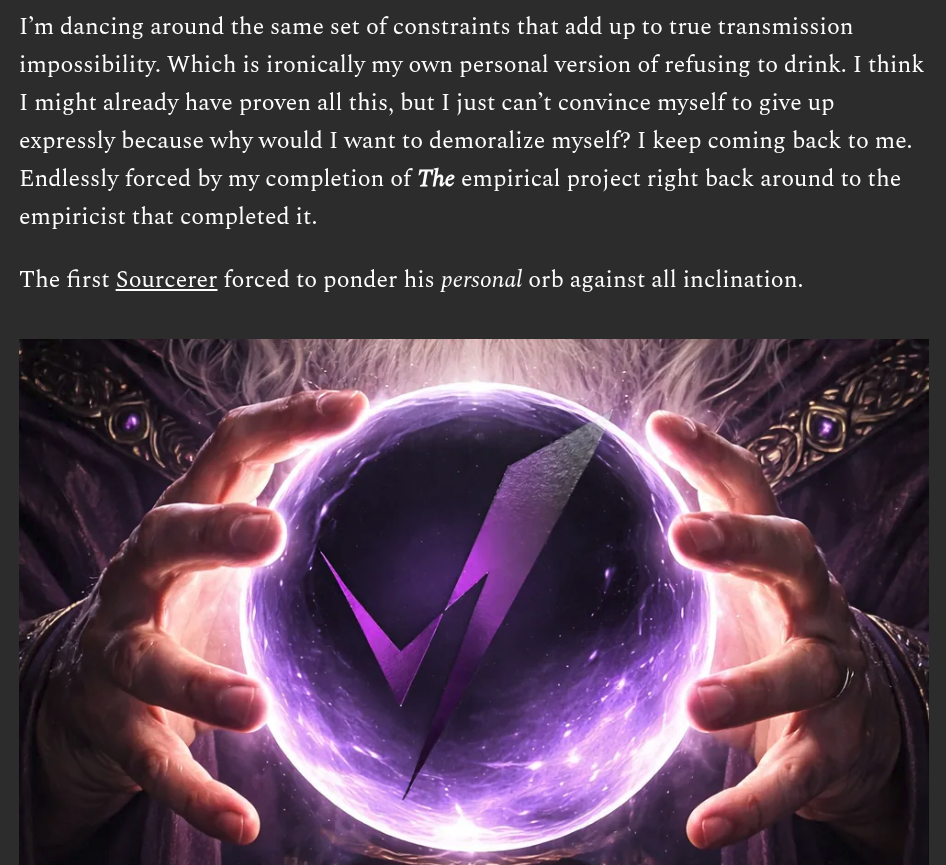

# EE Segment transcript

## Machine transcription

I'm dancing around the same set of constraints that add up to true transmission
impossibility. Which is ironically my own personal version of refusing to drink. I think
I might already have proven all this, but I just can’t convince myself to give up
expressly because why would I want to demoralize myself? I keep coming back to me.
Endlessly forced by my completion of The empirical project right back around to the

empiricist that completed it.

The first Sourcerer forced to ponder his personal orb against all inclination.
