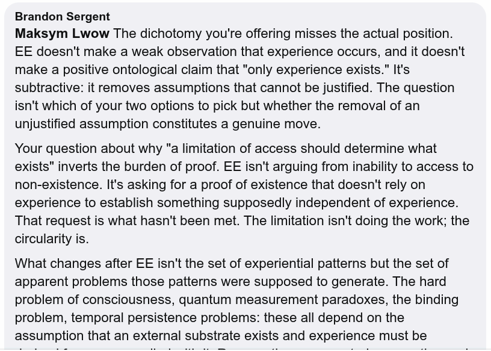

# EE Segment transcript

## Machine transcription

Brandon Sergent

Maksym Lwow The dichotomy you're offering misses the actual position.
EE doesn't make a weak observation that experience occurs, and it doesn't
make a positive ontological claim that "only experience exists." It's
subtractive: it removes assumptions that cannot be justified. The question
isn't which of your two options to pick but whether the removal of an
unjustified assumption constitutes a genuine move.

Your question about why "a limitation of access should determine what
exists" inverts the burden of proof. EE isn't arguing from inability to access to
non-existence. It's asking for a proof of existence that doesn't rely on
experience to establish something supposedly independent of experience.
That request is what hasn't been met. The limitation isn't doing the work; the
circularity is.

What changes after EE isn't the set of experiential patterns but the set of
apparent problems those patterns were supposed to generate. The hard
problem of consciousness, quantum measurement paradoxes, the binding
problem, temporal persistence problems: these all depend on the
assumption that an external substrate exists and experience must be
