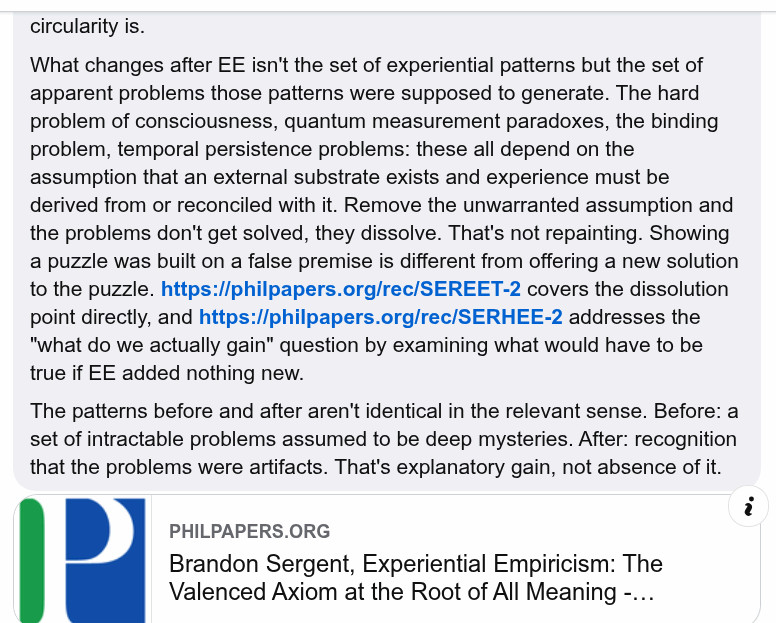

# EE Segment transcript

## Machine transcription

circularity is.

What changes after EE isn't the set of experiential patterns but the set of
apparent problems those patterns were supposed to generate. The hard
problem of consciousness, quantum measurement paradoxes, the binding
problem, temporal persistence problems: these all depend on the
assumption that an external substrate exists and experience must be
derived from or reconciled with it. Remove the unwarranted assumption and
the problems don't get solved, they dissolve. That's not repainting. Showing
a puzzle was built on a false premise is different from offering a new solution
to the puzzle. https://philpapers.org/rec/SEREET-2 covers the dissolution
point directly, and https://philpapers.org/rec/SERHEE-2 addresses the
"what do we actually gain" question by examining what would have to be
true if EE added nothing new.

The patterns before and after aren't identical in the relevant sense. Before: a
set of intractable problems assumed to be deep mysteries. After: recognition
that the problems were artifacts. That's explanatory gain, not absence of it.

P

PHILPAPERS.ORG

Brandon Sergent, Experiential Empiricism: The
Valenced Axiom at the Root of All Meaning -...
