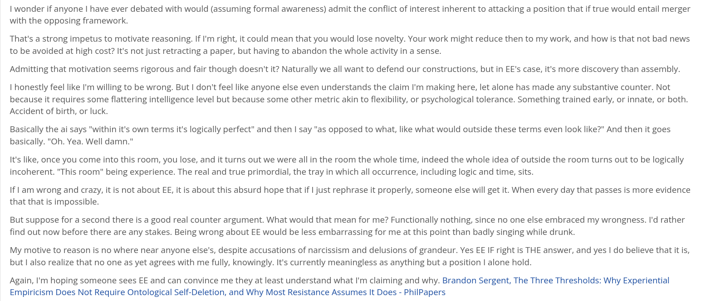

# EE Segment transcript

## Machine transcription

I wonder if anyone | have ever debated with would (assuming formal awareness) admit the conflict of interest inherent to attacking a position that if true would entail merger
with the opposing framework.

That's a strong impetus to motivate reasoning. If I'm right, it could mean that you would lose novelty. Your work might reduce then to my work, and how is that not bad news
to be avoided at high cost? It's not just retracting a paper, but having to abandon the whole activity in a sense.

Admitting that motivation seems rigorous and fair though doesn't it? Naturally we all want to defend our constructions, but in EE's case, it's more discovery than assembly.

I honestly feel like I'm willing to be wrong. But | don't feel like anyone else even understands the claim I'm making here, let alone has made any substantive counter. Not

because it requires some flattering intelligence level but because some other metric akin to flexibility, or psychological tolerance. Something trained early, or innate, or both.
Accident of birth, or luck.

Basically the ai says "within it's own terms it's logically perfect” and then | say "as opposed to what, like what would outside these terms even look like?" And then it goes
basically. "Oh. Yea. Well damn."

It's like, once you come into this room, you lose, and it turns out we were all in the room the whole time, indeed the whole idea of outside the room turns out to be logically
incoherent. "This room" being experience. The real and true primordial, the tray in which all occurrence, including logic and time, sits.

If 1 am wrong and crazy, it is not about EE, it is about this absurd hope that if | just rephrase it properly, someone else will get it. When every day that passes is more evidence
that that is impossible.

But suppose for a second there is a good real counter argument. What would that mean for me? Functionally nothing, since no one else embraced my wrongness. I'd rather
find out now before there are any stakes. Being wrong about EE would be less embarrassing for me at this point than badly singing while drunk.

My motive to reason is no where near anyone else's, despite accusations of narcissism and delusions of grandeur. Yes EE IF right is THE answer, and yes | do believe that it is,
but | also realize that no one as yet agrees with me fully, knowingly. It's currently meaningless as anything but a position I alone hold.

Again, I'm hoping someone sees EE and can convince me they at least understand what I'm claiming and why. Brandon Sergent, The Three Thresholds: Why Experiential
Empiricism Does Not Require Ontological Self-Deletion, and Why Most Resistance Assumes It Does - PhilPapers
