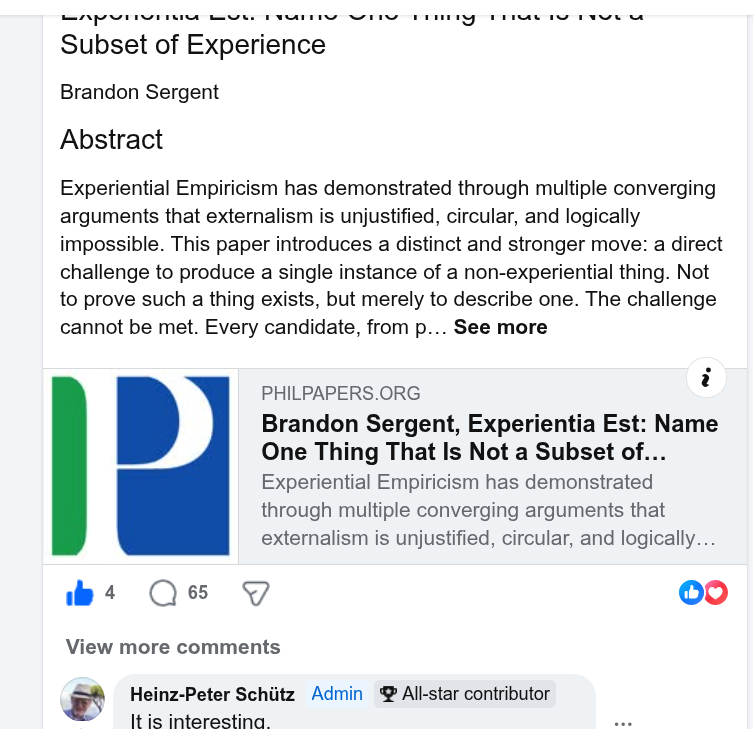

# EE Segment transcript

## Machine transcription

AR IS G U YIS Y Y A T 1Yo

Subset of Experience

Brandon Sergent

Abstract

Experiential Empiricism has demonstrated through multiple converging
arguments that externalism is unjustified, circular, and logically
impossible. This paper introduces a distinct and stronger move: a direct
challenge to produce a single instance of a non-experiential thing. Not
to prove such a thing exists, but merely to describe one. The challenge
cannot be met. Every candidate, from p... See more

PHILPAPERS.ORG :
Brandon Sergent, Experientia Est: Name
One Thing That Is Not a Subset of...
Experiential Empiricism has demonstrated
through multiple converging arguments that
externalism is unjustified, circular, and logically...

4 Qe Y [+1v]

View more comments

Heinz-Peter Schiitz Admin @ All-star contributor
It is interestina
