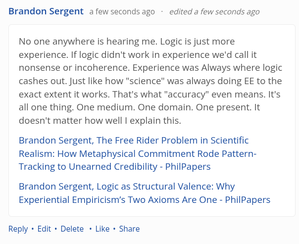

# EE Segment transcript

## Machine transcription

Brandon Sergent afew secondsago - edited a few seconds ago

No one anywhere is hearing me. Logic is just more
experience. If logic didn't work in experience we'd call it
nonsense or incoherence. Experience was Always where logic
cashes out. Just like how "science" was always doing EE to the
exact extent it works. That's what "accuracy” even means. It's
all one thing. One medium. One domain. One present. It
doesn't matter how well | explain this.

Brandon Sergent, The Free Rider Problem in Scientific
Realism: How Metaphysical Commitment Rode Pattern-
Tracking to Unearned Credibility - PhilPapers

Brandon Sergent, Logic as Structural Valence: Why
Experiential Empiricism’s Two Axioms Are One - PhilPapers

Reply « Edit + Delete « Like « Share
