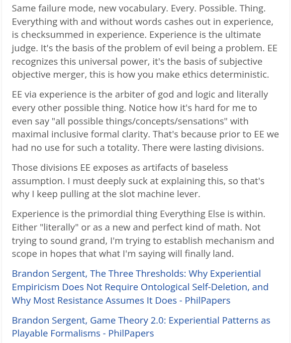

# EE Segment transcript

## Machine transcription

Same failure mode, new vocabulary. Every. Possible. Thing.
Everything with and without words cashes out in experience,
is checksummed in experience. Experience is the ultimate
judge. It's the basis of the problem of evil being a problem. EE
recognizes this universal power, it's the basis of subjective
objective merger, this is how you make ethics deterministic.

EE via experience is the arbiter of god and logic and literally
every other possible thing. Notice how it's hard for me to
even say "all possible things/concepts/sensations" with
maximal inclusive formal clarity. That's because prior to EE we
had no use for such a totality. There were lasting divisions.

Those divisions EE exposes as artifacts of baseless
assumption. | must deeply suck at explaining this, so that's
why | keep pulling at the slot machine lever.

Experience is the primordial thing Everything Else is within.
Either "literally" or as a new and perfect kind of math. Not
trying to sound grand, I'm trying to establish mechanism and
scope in hopes that what I'm saying will finally land.

Brandon Sergent, The Three Thresholds: Why Experiential
Empiricism Does Not Require Ontological Self-Deletion, and
Why Most Resistance Assumes It Does - PhilPapers

Brandon Sergent, Game Theory 2.0: Experiential Patterns as
Playable Formalisms - PhilPapers
