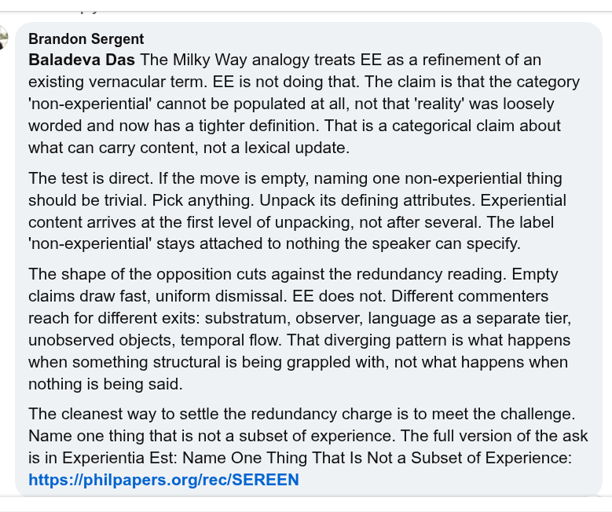

# EE Segment transcript

## Machine transcription

Brandon Sergent

Baladeva Das The Milky Way analogy treats EE as a refinement of an
existing vernacular term. EE is not doing that. The claim is that the category
'non-experiential' cannot be populated at all, not that 'reality’ was loosely
worded and now has a tighter definition. That is a categorical claim about
what can carry content, not a lexical update.

The test is direct. If the move is empty, naming one non-experiential thing
should be trivial. Pick anything. Unpack its defining attributes. Experiential
content arrives at the first level of unpacking, not after several. The label
'non-experiential' stays attached to nothing the speaker can specify.

The shape of the opposition cuts against the redundancy reading. Empty
claims draw fast, uniform dismissal. EE does not. Different commenters
reach for different exits: substratum, observer, language as a separate tier,
unobserved objects, temporal flow. That diverging pattern is what happens
when something structural is being grappled with, not what happens when
nothing is being said.

The cleanest way to settle the redundancy charge is to meet the challenge.
Name one thing that is not a subset of experience. The full version of the ask
is in Experientia Est: Name One Thing That Is Not a Subset of Experience:
https://iphilpapers.org/rec/SEREEN
