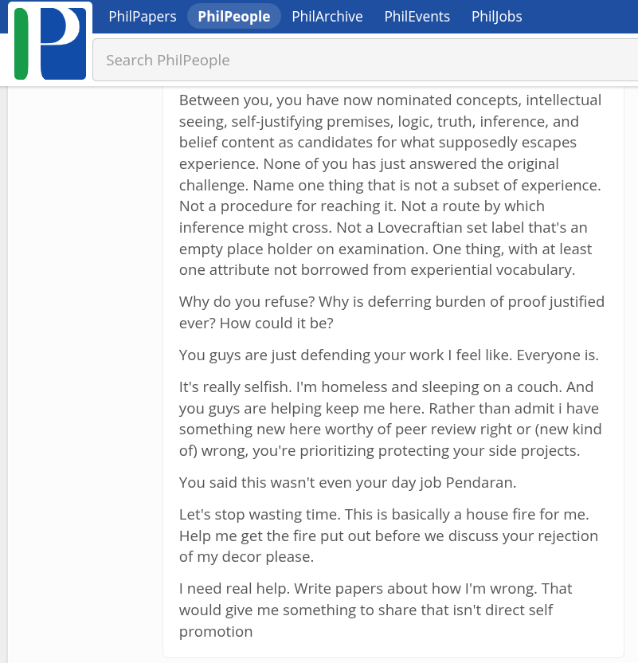

# EE Segment transcript

## Machine transcription

PhilPa PhilPeople  PhilArchive  PhilEvents  Philjob:

Search PhilPeople

Between you, you have now nominated concepts, intellectual
seeing, self-justifying premises, logic, truth, inference, and
belief content as candidates for what supposedly escapes
experience. None of you has just answered the original
challenge. Name one thing that is not a subset of experience.
Not a procedure for reaching it. Not a route by which
inference might cross. Not a Lovecraftian set label that's an
empty place holder on examination. One thing, with at least
one attribute not borrowed from experiential vocabulary.

Why do you refuse? Why is deferring burden of proof justified
ever? How could it be?

You guys are just defending your work | feel like. Everyone is.

It's really selfish. I'm homeless and sleeping on a couch. And
you guys are helping keep me here. Rather than admit i have
something new here worthy of peer review right or (new kind
of) wrong, you're prioritizing protecting your side projects.

You said this wasn't even your day job Pendaran.

Let's stop wasting time. This is basically a house fire for me.
Help me get the fire put out before we discuss your rejection
of my decor please.

I need real help. Write papers about how I'm wrong. That
would give me something to share that isn't direct self
promotion
