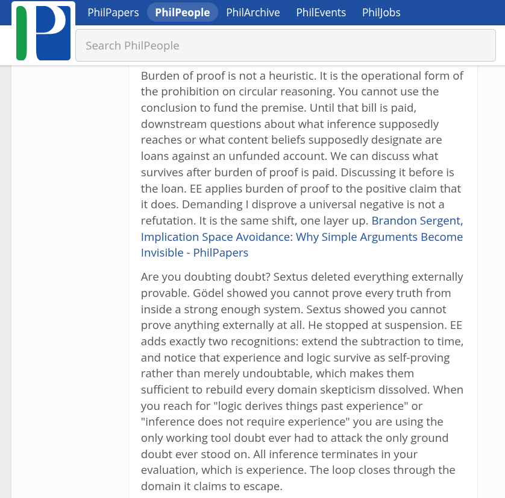

# EE Segment transcript

## Machine transcription

PhilPaps

PhilPeople  PhilArchive  PhilE

its  Philjob:

Search PhilPeople

Burden of proof is not a heuristic. It is the operational form of
the prohibition on circular reasoning. You cannot use the
conclusion to fund the premise. Until that bill is paid,
downstream questions about what inference supposedly
reaches or what content beliefs supposedly designate are
loans against an unfunded account. We can discuss what
survives after burden of proof is paid. Discussing it before is
the loan. EE applies burden of proof to the positive claim that
it does. Demanding | disprove a universal negative is not a
refutation. It is the same shift, one layer up. Brandon Sergent,
Implication Space Avoidance: Why Simple Arguments Become
Invisible - PhilPapers

Are you doubting doubt? Sextus deleted everything externally
provable. Godel showed you cannot prove every truth from
inside a strong enough system. Sextus showed you cannot
prove anything externally at all. He stopped at suspension. EE
adds exactly two recognitions: extend the subtraction to time,
and notice that experience and logic survive as self-proving
rather than merely undoubtable, which makes them
sufficient to rebuild every domain skepticism dissolved. When
you reach for "logic derives things past experience" or
"inference does not require experience" you are using the
only working tool doubt ever had to attack the only ground
doubt ever stood on. All inference terminates in your
evaluation, which is experience. The loop closes through the
domain it claims to escape.
