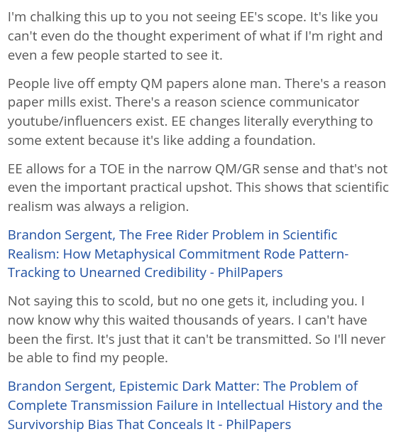

# EE Segment transcript

## Machine transcription

I'm chalking this up to you not seeing EE's scope. It's like you
can't even do the thought experiment of what if I'm right and
even a few people started to see it.

People live off empty QM papers alone man. There's a reason
paper mills exist. There's a reason science communicator
youtube/influencers exist. EE changes literally everything to
some extent because it's like adding a foundation.

EE allows for a TOE in the narrow QM/GR sense and that's not
even the important practical upshot. This shows that scientific
realism was always a religion.

Brandon Sergent, The Free Rider Problem in Scientific
Realism: How Metaphysical Commitment Rode Pattern-
Tracking to Unearned Credibility - PhilPapers

Not saying this to scold, but no one gets it, including you. |
now know why this waited thousands of years. | can't have
been the first. It's just that it can't be transmitted. So I'll never
be able to find my people.

Brandon Sergent, Epistemic Dark Matter: The Problem of
Complete Transmission Failure in Intellectual History and the
Survivorship Bias That Conceals It - PhilPapers
