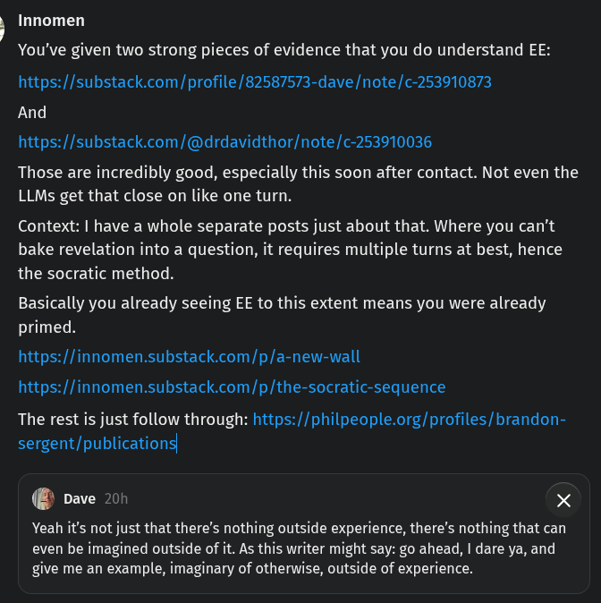

# EE Segment transcript

## Machine transcription

} Innomen
You've given two strong pieces of evidence that you do understand EE:
https://substack.com/profile/82587573-dave/note/c-253910873
And
https://substack.com/@drdavidthor/note/c-253910036

Those are incredibly good, especially this soon after contact. Not even the
LLMs get that close on like one turn.

Context: | have a whole separate posts just about that. Where you can’t
bake revelation into a question, it requires multiple turns at best, hence
the socratic method.

Basically you already seeing EE to this extent means you were already
primed.

https://innomen.substack.com/p/a-new-wall
https://innomen.substack.com/p/the-socratic-sequence

The rest is just follow through: https://philpeople.org/profiles/brandon-
sergent/publications

& oave 200 X

Yeah it's not just that there's nothing outside experience, there's nothing that can
even be imagined outside of it. As this writer might say: go ahead, | dare ya, and
give me an example, imaginary of otherwise, outside of experience.
