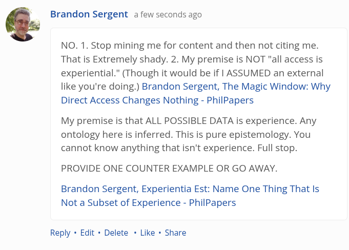

# EE Segment transcript

## Machine transcription

% Brandon Sergent a few seconds ago

NO. 1. Stop mining me for content and then not citing me.
That is Extremely shady. 2. My premise is NOT "all access is
experiential.” (Though it would be if | ASSUMED an external
like you're doing.) Brandon Sergent, The Magic Window: Why
Direct Access Changes Nothing - PhilPapers

My premise is that ALL POSSIBLE DATA is experience. Any
ontology here is inferred. This is pure epistemology. You
cannot know anything that isn't experience. Full stop.

PROVIDE ONE COUNTER EXAMPLE OR GO AWAY.
Brandon Sergent, Experientia Est: Name One Thing That Is

Not a Subset of Experience - PhilPapers

Reply « Edit + Delete « Like « Share
