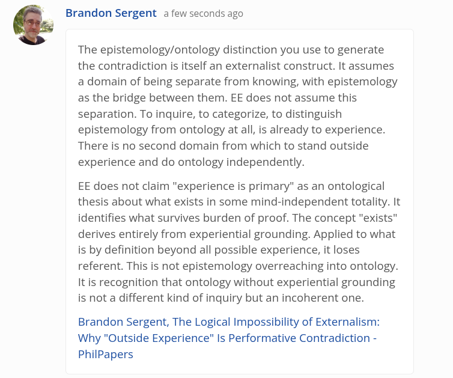

# EE Segment transcript

## Machine transcription

Brandon Sergent a few seconds ago

The epistemology/ontology distinction you use to generate
the contradiction is itself an externalist construct. It assumes
a domain of being separate from knowing, with epistemology
as the bridge between them. EE does not assume this
separation. To inquire, to categorize, to distinguish
epistemology from ontology at all, is already to experience.
There is no second domain from which to stand outside
experience and do ontology independently.

EE does not claim "experience is primary" as an ontological
thesis about what exists in some mind-independent totality. It
identifies what survives burden of proof. The concept "exists"
derives entirely from experiential grounding. Applied to what
is by definition beyond all possible experience, it loses
referent. This is not epistemology overreaching into ontology.
It is recognition that ontology without experiential grounding
is not a different kind of inquiry but an incoherent one.

Brandon Sergent, The Logical Impossibility of Externalism:
Why "Outside Experience" Is Performative Contradiction -
PhilPapers
