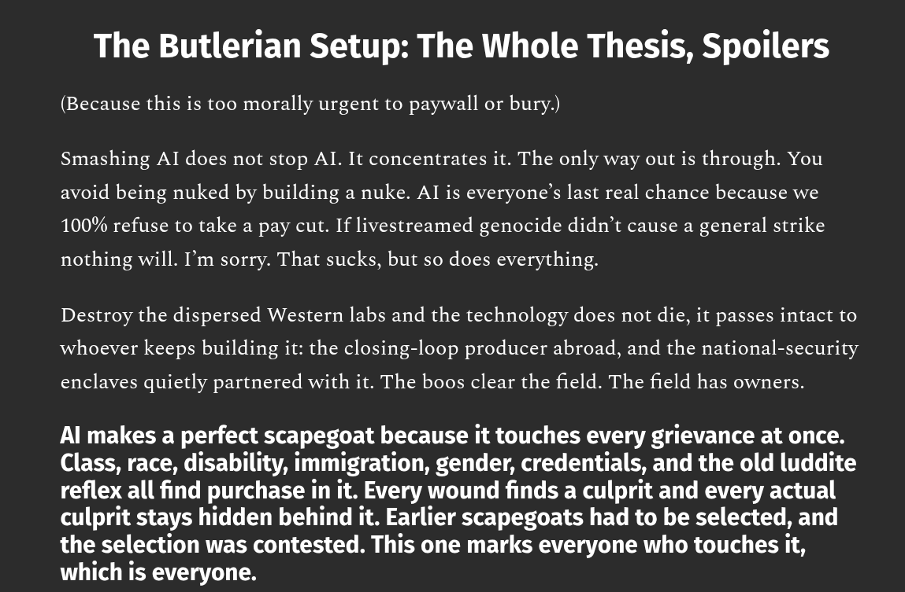

# EE Segment transcript

## Machine transcription

The Butlerian Setup: The Whole Thesis, Spoilers
(Because this is too morally urgent to paywall or bury.)

Smashing Al does not stop Al It concentrates it. The only way out is through. You
avoid being nuked by building a nuke. Al is everyone’s last real chance because we
100% refuse to take a pay cut. If livestreamed genocide didn’t cause a general strike

nothing will. I'm sorry. That sucks, but so does everything.

Destroy the dispersed Western labs and the technology does not die, it passes intact to
whoever keeps building it: the closing-loop producer abroad, and the national-security

enclaves quietly partnered with it. The boos clear the field. The field has owners.

Al makes a perfect scapegoat because it touches every grievance at once.
Class, race, disability, immigration, gender, credentials, and the old luddite
reflex all find purchase in it. Every wound finds a culprit and every actual
culprit stays hidden behind it. Earlier scapegoats had to be selected, and
the selection was contested. This one marks everyone who touches it,
which is everyone.
