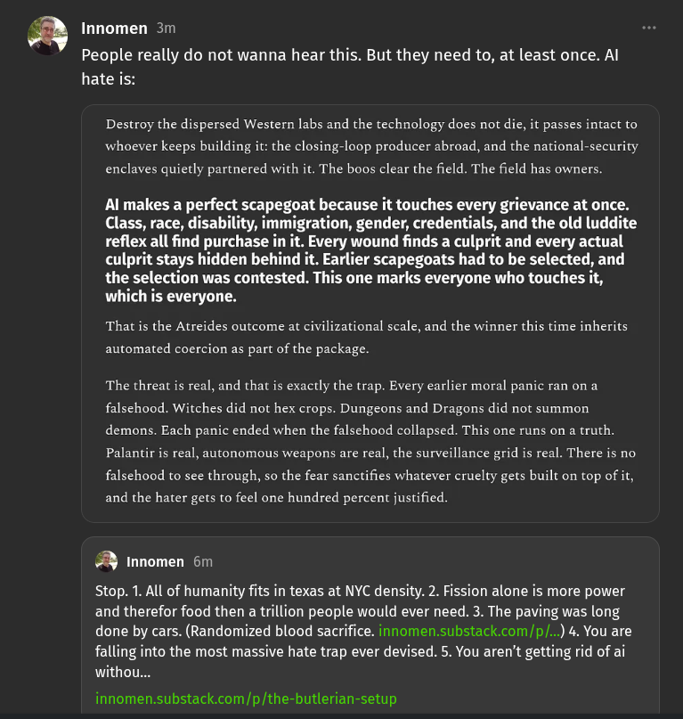

# EE Segment transcript

## Machine transcription

Innomen 3m

People really do not wanna hear this. But they need to, at least once. Al
hate is:

Destroy the dispersed Western labs and the technology does not die, it passes intact to
whoever keeps building it: the closing-loop producer abroad, and the national-security

enclaves quietly partnered with it. The boos clear the field. The field has owners.

Al makes a perfect scapegoat because it touches every grievance at once.
Class, race, disability, immigration, gender, credentials, and the old luddite
reflex all find purchase in it. Every wound finds a culprit and every actual
culprit stays hidden behind it. Earlier scapegoats had to be selected, and
the selection was contested. This one marks everyone who touches it,
which is everyone.

That is the Atreides outcome at civilizational scale, and the winner this time inherits

automated coercion as part of the package.

The threat is real, and that is exactly the trap. Every earlier moral panic ran on a
falsehood. Witches did not hex crops. Dungeons and Dragons did not summon
demons. Each panic ended when the falsehood collapsed. This one runs on a truth.
Palantir is real, autonomous weapons are real, the surveillance grid is real. There is no
falsehood to see through, so the fear sanctifies whatever cruelty gets built on top of it,

and the hater gets to feel one hundred percent justified

% innomen 6m

Stop. 1. All of humanity fits in texas at NYC density. 2. Fission alone is more power
and therefor food then a trillion people would ever need. 3. The paving was long
done by cars. (Randomized blood sacrifice. innomen.substack.com/p/...) 4. You are
falling into the most massive hate trap ever devised. 5. You aren't getting rid of ai
withou...

innomen.substack.com/p/the-butlerian-setup
