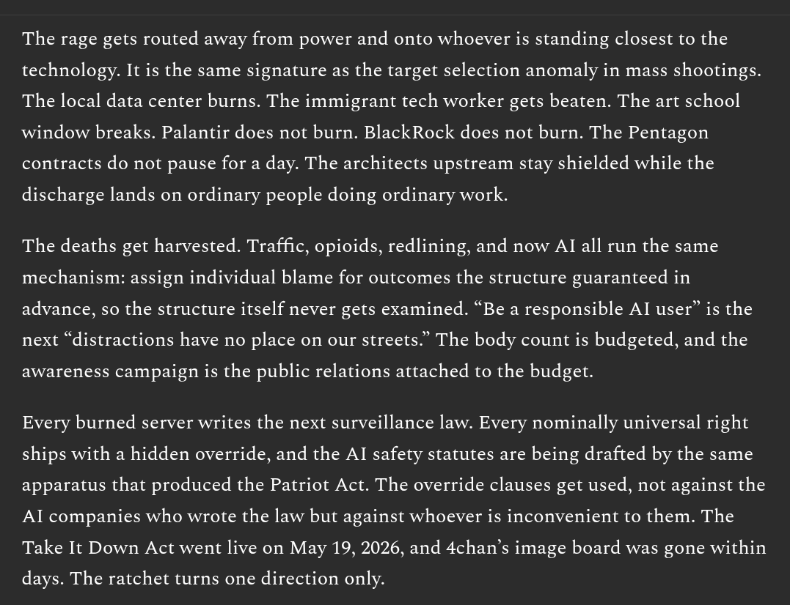

# EE Segment transcript

## Machine transcription

The rage gets routed away from power and onto whoever is standing closest to the
technology. It is the same signature as the target selection anomaly in mass shootings.
The local data center burns. The immigrant tech worker gets beaten. The art school
window breaks. Palantir does not burn. BlackRock does not burn. The Pentagon
contracts do not pause for a day. The architects upstream stay shielded while the

discharge lands on ordinary people doing ordinary work.

The deaths get harvested. Traffic, opioids, redlining, and now AI all run the same
mechanism: assign individual blame for outcomes the structure guaranteed in
advance, so the structure itself never gets examined. “Be a responsible Al user” is the
next “distractions have no place on our streets.” The body count is budgeted, and the

awareness campaign is the public relations attached to the budget.

Every burned server writes the next surveillance law. Every nominally universal right
ships with a hidden override, and the Al safety statutes are being drafted by the same
apparatus that produced the Patriot Act. The override clauses get used, not against the
Al companies who wrote the law but against whoever is inconvenient to them. The
Take It Down Act went live on May 19, 2026, and 4chan’s image board was gone within

days. The ratchet turns one direction only.
