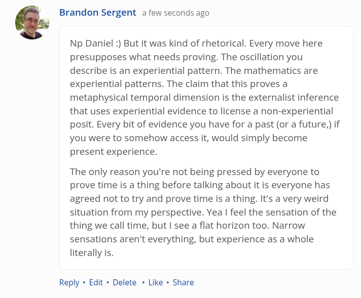

# EE Segment transcript

## Machine transcription

Brandon Sergent a few seconds ago

Np Daniel :) But it was kind of rhetorical. Every move here
presupposes what needs proving. The oscillation you
describe is an experiential pattern. The mathematics are
experiential patterns. The claim that this proves a
metaphysical temporal dimension is the externalist inference
that uses experiential evidence to license a non-experiential
posit. Every bit of evidence you have for a past (or a future,) if
you were to somehow access it, would simply become
present experience.

The only reason you're not being pressed by everyone to
prove time is a thing before talking about it is everyone has
agreed not to try and prove time is a thing. It's a very weird
situation from my perspective. Yea | feel the sensation of the
thing we call time, but | see a flat horizon too. Narrow
sensations aren't everything, but experience as a whole
literally is.

Reply « Edit + Delete « Like « Share
