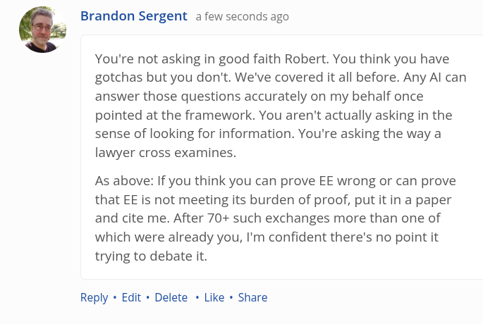

# EE Segment transcript

## Machine transcription

Q Brandon Sergent a few seconds ago

You're not asking in good faith Robert. You think you have
gotchas but you don't. We've covered it all before. Any Al can
answer those questions accurately on my behalf once
pointed at the framework. You aren't actually asking in the
sense of looking for information. You're asking the way a
lawyer cross examines.

As above: If you think you can prove EE wrong or can prove
that EE is not meeting its burden of proof, putitin a paper
and cite me. After 70+ such exchanges more than one of
which were already you, I'm confident there's no point it
trying to debate it.

Reply « Edit + Delete « Like « Share
