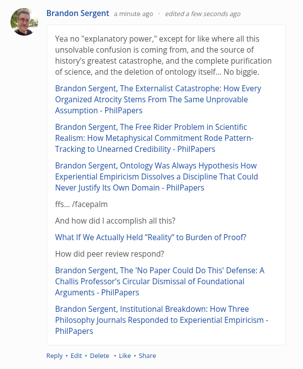

# EE Segment transcript

## Machine transcription

* Brandon Sergent aminute ago - edited a few seconds ago

Yea no "explanatory power,” except for like where all this
unsolvable confusion is coming from, and the source of
history's greatest catastrophe, and the complete purification
of science, and the deletion of ontology itself... No biggie.

Brandon Sergent, The Externalist Catastrophe: How Every
Organized Atrocity Stems From The Same Unprovable
Assumption - PhilPapers

Brandon Sergent, The Free Rider Problem in Scientific
Realism: How Metaphysical Commitment Rode Pattern-
Tracking to Unearned Credibility - PhilPapers

Brandon Sergent, Ontology Was Always Hypothesis How
Experiential Empiricism Dissolves a Discipline That Could
Never Justify Its Own Domain - PhilPapers

ffs... ffacepalm

And how did | accomplish all this?

What If We Actually Held "Reality” to Burden of Proof?
How did peer review respond?

Brandon Sergent, The 'No Paper Could Do This' Defense: A
Challis Professor's Circular Dismissal of Foundational
Arguments - PhilPapers

Brandon Sergent, Institutional Breakdown: How Three
Philosophy Journals Responded to Experiential Empiricism -
PhilPapers

Reply - Edit - Delete - Like « Share
