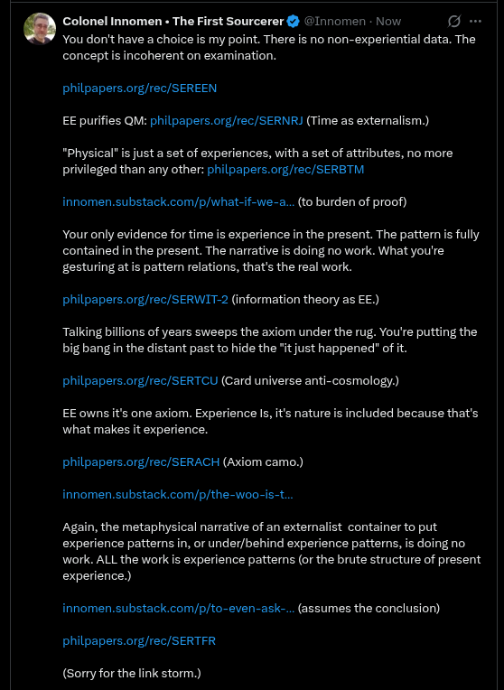

# EE Segment transcript

## Machine transcription

. Colonel Innomen « The First Sourcerer & @1nnom

You don't have a choice is my point. There is no non-experiential data. The
incoherent on examination.

concept

philpapers.org/rec/SEREEN

EE purifies QM: philpapers.org/rec/SERNR) (Time as externalism.)

“Phy
pri

ical" is just a set of experiences, with a set of attributes, no more
leged than any other: philpapers.org/rec/SERBTM

innomen.substack.com/p/what-if-we-a...(to burden of proof)
Your only evidence for time is experience in the present. The pattern is fully
contained in the present. The narrative is doing no work. What you're

gesturing atis pattern relations, that's the real work.

philpapers.org/rec/SERWIT-2 (information theory as EE.)

Talking billions of years sweeps the a
big bang in the distant past to hide the *

m under the rug. You're putting the
just happened” of it.

philpapers.org/rec/SERTCU (Card universe anti-cosmology.)

EE owns it's one axiom. Experience Is, it's nature is included because that's

what makes it experience.
philpapers.org/rec/SERACH (Axiom camo.)

innomen. substack.com/p/the-woo-is-t..

‘Again, the metaphysical narrative of an exteralist container to put
experience patterns in, or under/behind experience patterns, is doing no

work. ALL the work s experience patters (or the brute structure of present
experience)

nomen.substack.com/p/to-even-ask-... (assumes the conclusion)
philpapers.org/rec/SERTFR

(Sorry for the link storm.)
