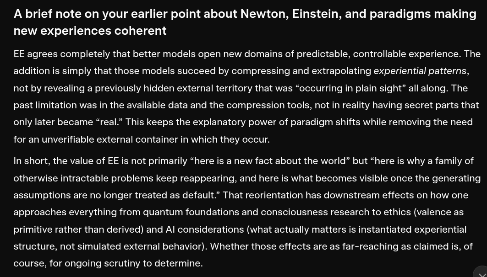

# EE Segment transcript

## Machine transcription

A brief note on your earlier point about Newton, Einstein, and paradigms making
new experiences coherent

EE agrees completely that better models open new domains of predictable, controllable experience. The
addition is simply that those models succeed by compressing and extrapolating experiential patterns,
not by revealing a previously hidden external territory that was “occurring in plain sight” all along. The
past limitation was in the available data and the compression tools, not in reality having secret parts that
only later became “real.” This keeps the explanatory power of paradigm shifts while removing the need

for an unverifiable external container in which they occur.

In short, the value of EE is not primarily “here is a new fact about the world” but “here is why a family of
otherwise intractable problems keep reappearing, and here is what becomes visible once the generating
assumptions are no longer treated as default.” That reorientation has downstream effects on how one
approaches everything from quantum foundations and consciousness research to ethics (valence as
primitive rather than derived) and Al considerations (what actually matters is instantiated experiential
structure, not simulated external behavior). Whether those effects are as far-reaching as claimed is, of

course, for ongoing scrutiny to determine.
