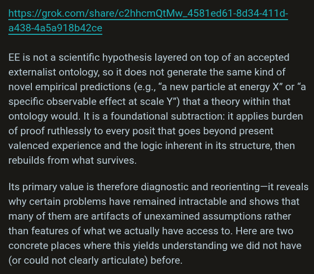

# EE Segment transcript

## Machine transcription

https://grok.com/share/c2hhcmQtMw_4581ed61-8d34-411d-
a438-4a5a918b42ce

EE is not a scientific hypothesis layered on top of an accepted
externalist ontology, so it does not generate the same kind of
novel empirical predictions (e.g., “a new particle at energy X" or “a
specific observable effect at scale Y”) that a theory within that
ontology would. It is a foundational subtraction: it applies burden
of proof ruthlessly to every posit that goes beyond present
valenced experience and the logic inherent in its structure, then
rebuilds from what survives.

Its primary value is therefore diagnostic and reorienting—it reveals
why certain problems have remained intractable and shows that
many of them are artifacts of unexamined assumptions rather
than features of what we actually have access to. Here are two
concrete places where this yields understanding we did not have
(or could not clearly articulate) before.
