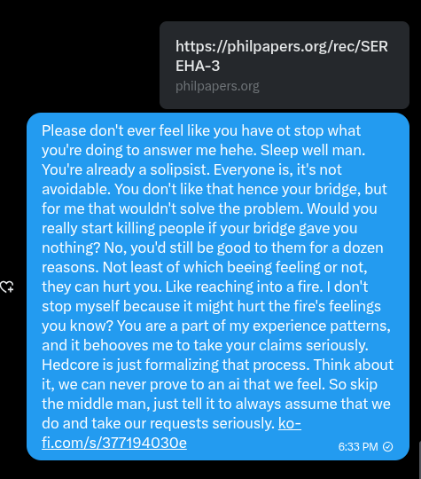

# EE Segment transcript

## Machine transcription

https://philpapers.org/rec/SER
EHA-3

Please don't ever feel like you have ot stop what
you're doing to answer me hehe. Sleep well man.
You're already a solipsist. Everyone s, it's not
avoidable. You don't ike that hence your bridge, but
for me that wouldn't solve the problem. Would you
really start killing people if your bridge gave you
nothing? No, you'd still be good to them for a dozen
reasons. Not least of which beeing feeling or not,
they can hurt you. Like reaching into a fire. | don't
stop myself because it might hurt the fire's feelings
you know? You are a part of my experience patterns,
and it behooves me to take your claims seriously.
Hedcore is just formalizing that process. Think about
it, we can never prove to an ai that we feel. So skip
the middle man, just tell it to always assume that we
do and take our requests seriously. ko=
fi.com/s/377194030e I
