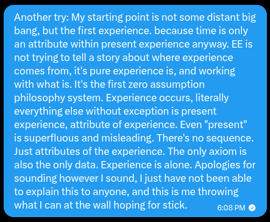

# EE Segment transcript

## Machine transcription

Another try: My starting point is not some distant big
bang, but the first experience. because time is only
an attribute within present experience anyway. EE is
not trying to tell a story about where experience
comes from, it's pure experience is, and working
with whatis. It's the first zero assumption
philosophy system. Experience oceurs, literally
everything else without exception is present
experience, attribute of experience. Even "present”
is superfluous and misleading. There's no sequence.
Just attributes of the experience. The only axiom is
also the only data. Experience is alone. Apologies for
sounding however | sound, | just have not been able
to explain this to anyone, and this is me throwing
what| can at the wall hoping for stick.  gospm @
