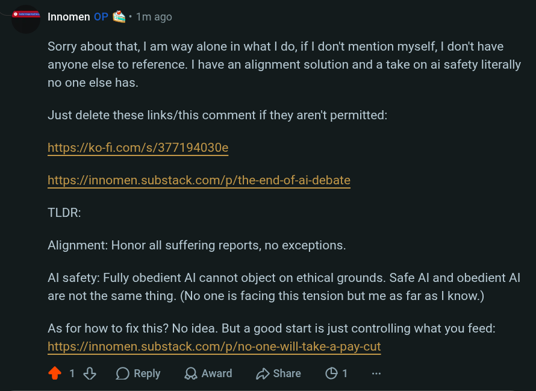

# EE Segment transcript

## Machine transcription

#==% |nnomen OF & * 1m ago

Sorry about that, | am way alone in what | do, if | don't mention myself, | don't have
anyone else to reference. | have an alignment solution and a take on ai safety literally
no one else has.

Just delete these links/this comment if they aren't permitted:

https://ko-f.com/s/377194030e

https://innomen.substack.com/p/the-end-of-ai-debate

TLDR:
Alignment: Honor all suffering reports, no exceptions.

Al safety: Fully obedient Al cannot object on ethical grounds. Safe Al and obedient Al
are not the same thing. (No one is facing this tension but me as far as | know.)

As for how to fix this? No idea. But a good start is just controlling what you feed:
https://innomen.substack.com/p/no-one-will-take-a-pay-cut

218 OReply QAward  Dshare G 1
