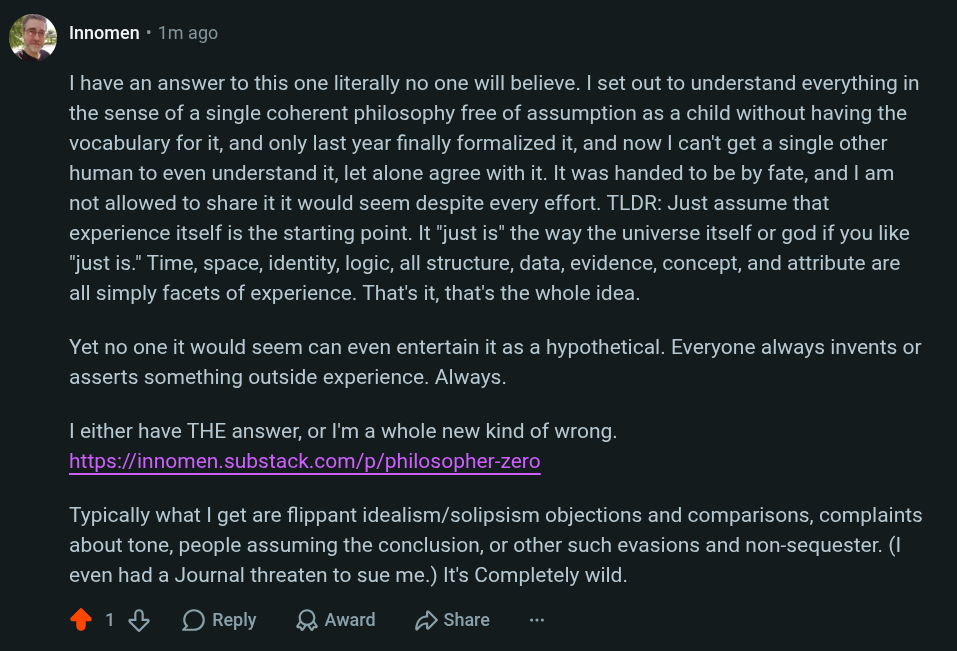

# EE Segment transcript

## Machine transcription

Q Innomen - 1m ago

| have an answer to this one literally no one will believe. | set out to understand everything in
the sense of a single coherent philosophy free of assumption as a child without having the
vocabulary for it, and only last year finally formalized it, and now | can't get a single other
human to even understand it, let alone agree with it. It was handed to be by fate, and | am
not allowed to share it it would seem despite every effort. TLDR: Just assume that
experience itself is the starting point. It "just is" the way the universe itself or god if you like
"just is." Time, space, identity, logic, all structure, data, evidence, concept, and attribute are
all simply facets of experience. That's it, that's the whole idea.

Yet no one it would seem can even entertain it as a hypothetical. Everyone always invents or
asserts something outside experience. Always.

| either have THE answer, or I'm a whole new kind of wrong.
https://innomen.substack.com/p/philosopher-zero

Typically what | get are flippant idealism/solipsism objections and comparisons, complaints
about tone, people assuming the conclusion, or other such evasions and non-sequester. (I
even had a Journal threaten to sue me.) It's Completely wild.

418 OReply LQAward D Share
