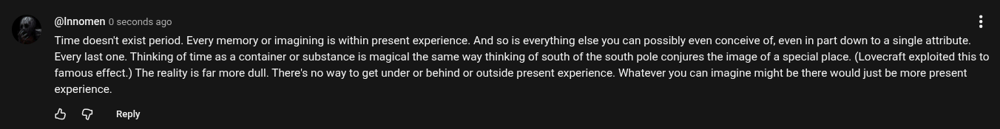

# EE Segment transcript

## Machine transcription

@Innomen 0 seconds ago H
Time doesn't exist period. Every memory or imagining is within present experience. And so is everything else you can possibly even conceive of, even in part down to a single attribute.
Every last one. Thinking of time as a container or substance is magical the same way thinking of south of the south pole conjures the image of a special place. (Lovecraft exploited this to
famous effect.) The reality is far more dull. There's no way to get under or behind or outside present experience. Whatever you can imagine might be there would just be more present
experience.

& @ Reply
