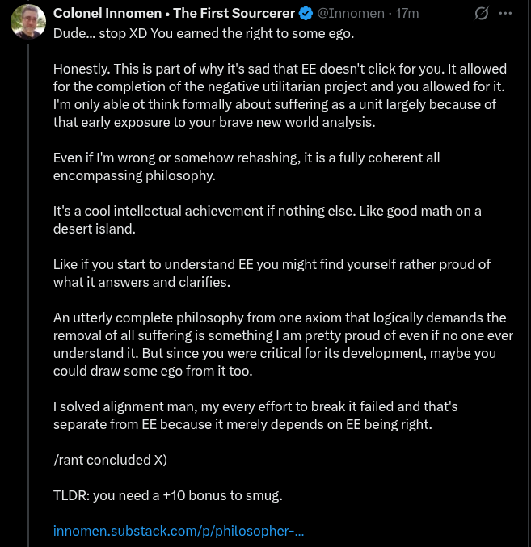

# EE Segment transcript

## Machine transcription

Colonel Innomen « The First Sourcerer & @Innomen - 17m [
Dude... stop XD You earned the right to some ego.

Honestly. This is part of why it's sad that EE doesn't click for you. It allowed
for the completion of the negative utilitarian project and you allowed for it.
Im only able ot think formally about suffering as a unit largely because of
that early exposure to your brave new world analysis.

Even if I'm wrong or somehow rehashing, it is a fully coherent all
encompassing philosophy.

It's a cool intellectual achievement if nothing else. Like good math on a
desert island.

Like if you start to understand EE you might find yourself rather proud of
whatit answers and clarifies.

An utterly complete philosophy from one axiom that logically demands the
removal of all suffering is something | am pretty proud of even if no one ever
understand it. But since you were critical for its development, maybe you
could draw some ego from it too.

I solved alignment man, my every effort to break it failed and that's
separate from EE because it merely depends on EE being right.

Jrant concluded X)
TLDR: you need a +10 bonus to smug.

innomen.substack.com/p/philosopher-..
