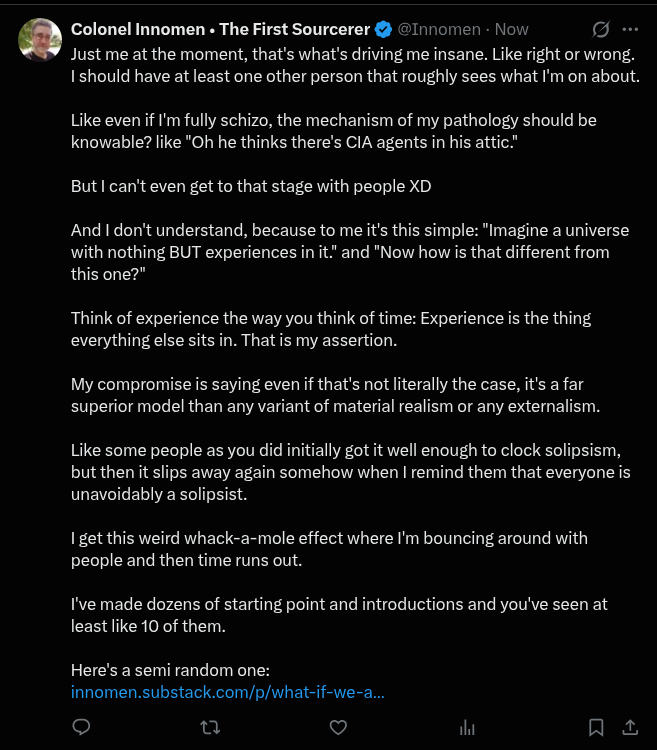

# EE Segment transcript

## Machine transcription

Q Colonel Innomen « The First Sourcerer & @Innomen - Now ]

Just me at the moment, that's what's driving me insane. Like right or wrong.
Ishould have at least one other person that roughly sees what I'm on about.

Like even if I'm fully schizo, the mechanism of my pathology should be
knowable? like "Oh he thinks there's CIA agents in his attic."

But | can't even get to that stage with people XD

And | don't understand, because to me it's this simple: "Imagine a universe
with nothing BUT experiences in it." and "Now how is that different from
this one?"

Think of experience the way you think of time: Experience is the thing
everything else sits in. That is my assertion.

My compromise is saying even if that's not literally the case, it's a far
superior model than any variant of material realism or any externalism.

Like some people as you did initially got it well enough to clock solipsism,
but then it slips away again somehow when | remind them that everyone is
unavoidably a solipsist.

I get this weird whack-a-mole effect where I'm bouncing around with
people and then time runs out.

I've made dozens of starting point and introductions and you've seen at
least like 10 of them.

Here's a semi random one:
innomen.substack.com/p/what-if-we-a...

o n v ihi Al

[
