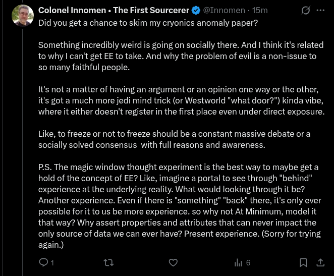

# EE Segment transcript

## Machine transcription

Colonel Innomen « The First Sourcerer & @Innomen - 15m o -
Did you get a chance to skim my cryonics anomaly paper?

Something incredibly weird is going on socially there. And I think it's related
to why | can't get EE to take. And why the problem of evil is a non-issue to
so many faithful people.

It's not a matter of having an argument or an opinion one way or the other,
it's got a much more jedi mind trick (or Westworld "what door?") kinda vibe,
Wwhere it either doesn't register in the first place even under direct exposure.

Like, to freeze or not to freeze should be a constant massive debate or a
socially solved consensus with full reasons and awareness.

PS. The magic window thought experiment is the best way to maybe get a
hold of the concept of EE? Like, imagine a portal to see through "behind”
experience at the underlying reality. What would looking through it be?
Another experience. Even if there is "something" "back” there, it's only ever
possible for it to us be more experience. so why not At Minimum, model it
that way? Why assert properties and attributes that can never impact the
only source of data we can ever have? Present experience. (Sorry for trying
again.)

O1 u v il & na
