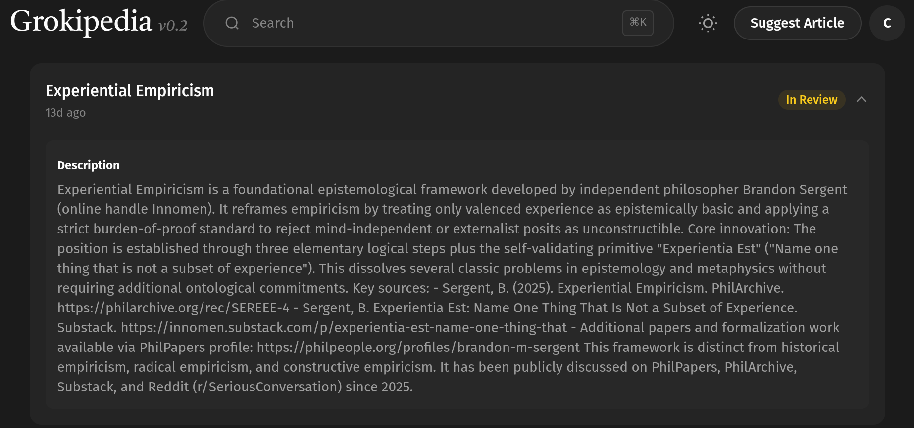

# EE Segment transcript

## Machine transcription

GrOkipedia v0.2 Q Search ®K X Suggest Article C

Experiential Empiricism
13d ago

In Review A~

Description

Experiential Empiricism is a foundational epistemological framework developed by independent philosopher Brandon Sergent
(online handle Innomen). It reframes empiricism by treating only valenced experience as epistemically basic and applying a
strict burden-of-proof standard to reject mind-independent or externalist posits as unconstructible. Core innovation: The
position is established through three elementary logical steps plus the self-validating primitive "Experientia Est" ("Name one
thing that is not a subset of experience"). This dissolves several classic problems in epistemology and metaphysics without
requiring additional ontological commitments. Key sources: - Sergent, B. (2025). Experiential Empiricism. PhilArchive.
https://philarchive.org/rec/SEREEE-4 - Sergent, B. Experientia Est: Name One Thing That Is Not a Subset of Experience.
Substack. https://innomen.substack.com/p/experientia-est-name-one-thing-that - Additional papers and formalization work
available via PhilPapers profile: https://philpeople.org/profiles/brandon-m-sergent This framework is distinct from historical
empiricism, radical empiricism, and constructive empiricism. It has been publicly discussed on PhilPapers, PhilArchive,
Substack, and Reddit (r/SeriousConversation) since 2025.
