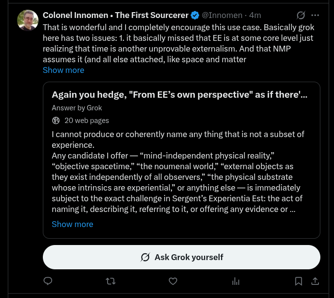

# EE Segment transcript

## Machine transcription

2

Colonel Innomen « The First Sourcerer & @lnnomen - 4m o o
Thatis wonderful and | completely encourage this use case. Basically grok
here has two issues: 1. it basically missed that EE is at some core level just
realizing that time is another unprovable externalism. And that NMP
assumes it (and all else attached, like space and matter

Show more

Again you hedge, "From EE’s own perspective" as if there'...
Answer by Grok
® 20 web pages

I cannot produce or coherently name any thing that s not a subset of
experience.

Any candidate | offer— “mind-independent physical reality,”
“objective spacetime;” “the noumenal world,” “external objects as
they exist independently of all observers.” “the physical substrate
whose intrinsics are experiential,” or anything else — is immediately
subject to the exact challenge in Sergent’s Experientia Est: the act of
naming it, describing it, referring to it, or offering any evidence or ...

Show more

Ask Grok yourself

o u v ihi na
