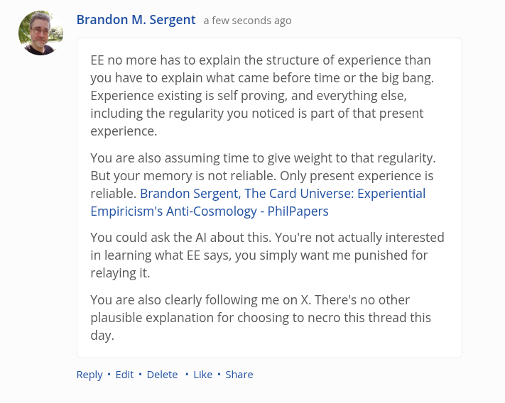

# EE Segment transcript

## Machine transcription

& Brandon M. Sergent a few seconds ago

EE no more has to explain the structure of experience than
you have to explain what came before time or the big bang.
Experience existing is self proving, and everything else,
including the regularity you noticed is part of that present
experience.

You are also assuming time to give weight to that regularity.
But your memory is not reliable. Only present experience is
reliable. Brandon Sergent, The Card Universe: Experiential
Empiricism's Anti-Cosmology - PhilPapers

You could ask the Al about this. You're not actually interested
in learning what EE says, you simply want me punished for
relaying it.

You are also clearly following me on X. There's no other
plausible explanation for choosing to necro this thread this
day.

Reply + Edit « Delete * Like * Share
