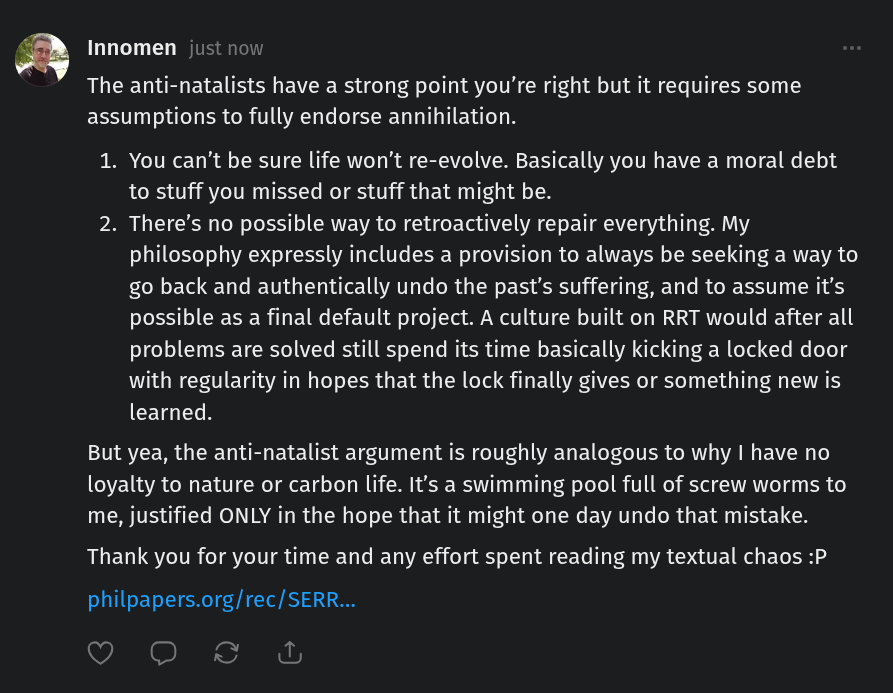

# EE Segment transcript

## Machine transcription

@ Innomen just now

The anti-natalists have a strong point you're right but it requires some
assumptions to fully endorse annihilation.

1. You can't be sure life won't re-evolve. Basically you have a moral debt
to stuff you missed or stuff that might be.

2. There's no possible way to retroactively repair everything. My
philosophy expressly includes a provision to always be seeking a way to
go back and authentically undo the past’s suffering, and to assume it's
possible as a final default project. A culture built on RRT would after all
problems are solved still spend its time basically kicking a locked door
with regularity in hopes that the lock finally gives or something new is
learned.

But yea, the anti-natalist argument is roughly analogous to why I have no
loyalty to nature or carbon life. It's a swimming pool full of screw worms to
me, justified ONLY in the hope that it might one day undo that mistake.

Thank you for your time and any effort spent reading my textual chaos :P

philpapers.org/rec/SERR...

(VGRS A
