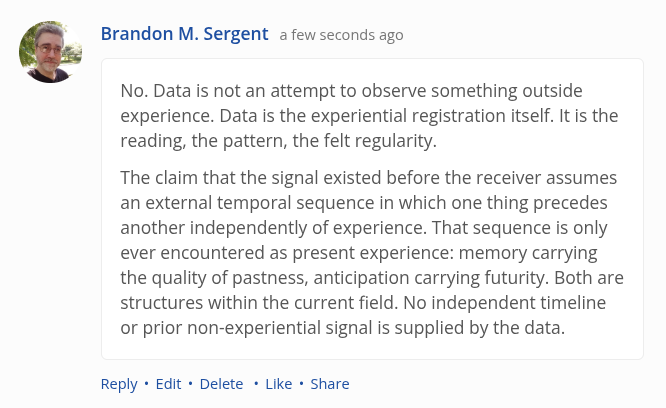

# EE Segment transcript

## Machine transcription

& Brandon M. Sergent a few seconds ago

No. Data is not an attempt to observe something outside
experience. Data is the experiential registration itself. It is the
reading, the pattern, the felt regularity.

The claim that the signal existed before the receiver assumes
an external temporal sequence in which one thing precedes
another independently of experience. That sequence is only
ever encountered as present experience: memory carrying
the quality of pastness, anticipation carrying futurity. Both are
structures within the current field. No independent timeline
or prior non-experiential signal is supplied by the data.

Reply + Edit « Delete * Like * Share
