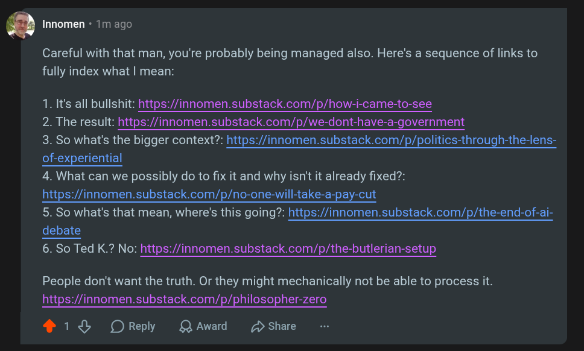

# EE Segment transcript

## Machine transcription

@ Innomen - 1m ago

Careful with that man, you're probably being managed also. Here's a sequence of links to
fully index what | mean:

1. It's all bullshit: https://innomen.substack.com/p/how-i-came-to-see

2. The result: https://innomen.substack.com/p/we-dont-have-a-government

3. So what's the bigger context?: https://innomen.substack.com/p/politics-through-the-lens-
of-experiential

4. What can we possibly do to fix it and why isn't it already fixed?:
https://innomen.substack.com/p/no-one-will-take-a-pay-cut

5. So what's that mean, where's this going?: https://innomen.substack.com/p/the-end-of-ai-
debate

6. So Ted K.? No: https://innomen.substack.com/p/the-butlerian-setup

People don't want the truth. Or they might mechanically not be able to process it.
https://innomen.substack.com/p/philosopher-zero

® 18 OReply LQAward D Share
