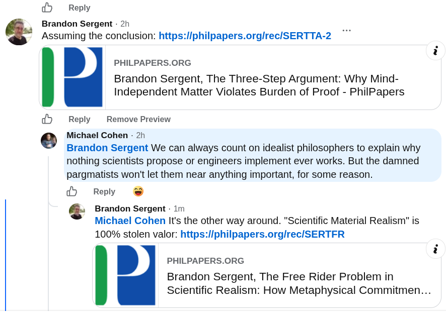

# EE Segment transcript

## Machine transcription

@9  Reply

Brandon Sergent - 2h
Assuming the conclusion: https:/iphilpapers.orglrec/SERTTA-2

PHILPAPERS.ORG
Brandon Sergent, The Three-Step Argument: Why Mind-
Independent Matter Violates Burden of Proof - PhilPapers

Reply ~ Remove Preview
Michael Cohen - 2h
Brandon Sergent We can always count on idealist philosophers to explain why

nothing scientists propose or engineers implement ever works. But the damned
pargmatists won't let them near anything important, for some reason.

@ Reply @

‘. Brandon Sergent - 1m
Michael Cohen It's the other way around. "Scientific Material Realism" is
100% stolen valor: https:/iphilpapers.orglrec/SERTFR

. PHILPAPERS.ORG
Brandon Sergent, The Free Rider Problem in
Scientific Realism: How Metaphysical Commitmen...

~

~
