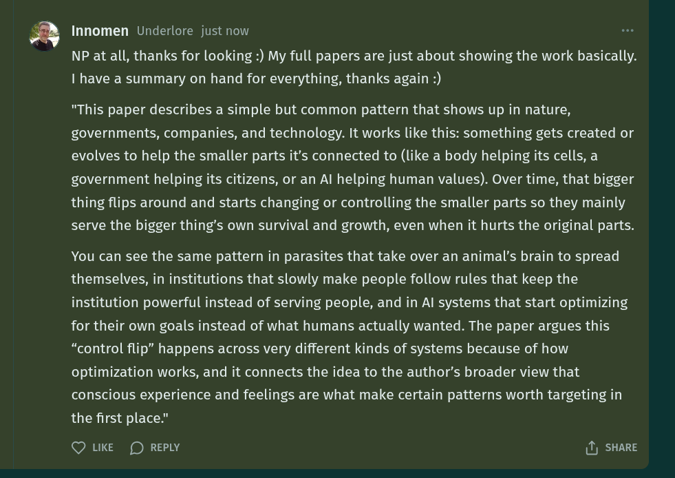

# EE Segment transcript

## Machine transcription

'Q Innomen Underlore just now
NP at all, thanks for looking :) My full papers are just about showing the work basically.
I have a summary on hand for everything, thanks again :)

"This paper describes a simple but common pattern that shows up in nature,
governments, companies, and technology. It works like this: something gets created or
evolves to help the smaller parts it's connected to (like a body helping its cells, a
government helping its citizens, or an Al helping human values). Over time, that bigger
thing flips around and starts changing or controlling the smaller parts so they mainly
serve the bigger thing’s own survival and growth, even when it hurts the original parts.

You can see the same pattern in parasites that take over an animal’s brain to spread
themselves, in institutions that slowly make people follow rules that keep the
institution powerful instead of serving people, and in Al systems that start optimizing
for their own goals instead of what humans actually wanted. The paper argues this
“control flip” happens across very different kinds of systems because of how
optimization works, and it connects the idea to the author’s broader view that
conscious experience and feelings are what make certain patterns worth targeting in
the first place."

Q LKE (D REPLY 1) SHARE
