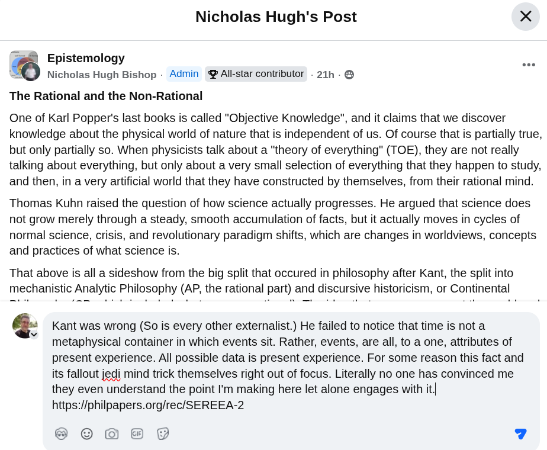

# EE Segment transcript

## Machine transcription

Nicholas Hugh's Post X

@& Epistemology
| Nicholas Hugh Bishop - Admin @ All-star contributor - 21h - @

The Rational and the Non-Rational

One of Karl Popper's last books is called "Objective Knowledge", and it claims that we discover
knowledge about the physical world of nature that is independent of us. Of course that is partially true,

but only partially so. When physicists talk about a "theory of everything” (TOE), they are not really
talking about everything, but only about a very small selection of everything that they happen to study,
and then, in a very artificial world that they have constructed by themselves, from their rational mind.

Thomas Kuhn raised the question of how science actually progresses. He argued that science does
not grow merely through a steady, smooth accumulation of facts, but it actually moves in cycles of
normal science, crisis, and revolutionary paradigm shifts, which are changes in worldviews, concepts
and practices of what science is.

That above is all a sideshow from the big split that occured in philosophy after Kant, the split into
mechanistic Analytic Philosophy (AP, the rational part) and discursive historicism, or Continental

Q‘ Kant was wrong (So is every other externalist.) He failed to notice that time is not a
v metaphysical container in which events sit. Rather, events, are all, to a one, attributes of
present experience. All possible data is present experience. For some reason this fact and
its fallout jedi mind trick themselves right out of focus. Literally no one has convinced me
they even understand the point I'm making here let alone engages with it/
https://philpapers.org/rec/SEREEA-2
