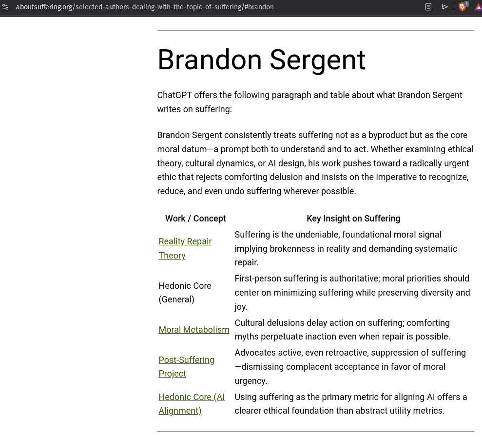

# EE Segment transcript

## Machine transcription

Brandon Sergent

ChatGPT offers the following paragraph and table about what Brandon Sergent

writes on suffering:

Brandon Sergent consistently treats suffering not as a byproduct but as the core
moral datum—a prompt both to understand and to act. Whether examining ethical
theory, cultural dynamics, or Al design, his work pushes toward a radically urgent
ethic that rejects comforting delusion and insists on the imperative to recognize,

reduce, and even undo suffering wherever possible.

Work / Concept

Reality Repair
Theory

Hedonic Core
(General)

Moral Metabolism

Post-Suffering
Project

Hedonic Core (Al
Alignment)

Key Insight on Suffering

Suffering is the undeniable, foundational moral signal
implying brokenness in reality and demanding systematic
repair.

First-person suffering is authoritative; moral priorities should
center on minimizing suffering while preserving diversity and
Joy.

Cultural delusions delay action on suffering; comforting
myths perpetuate inaction even when repair is possible.
Advocates active, even retroactive, suppression of suffering
—dismissing complacent acceptance in favor of moral
urgency.

Using suffering as the primary metric for aligning Al offers a
clearer ethical foundation than abstract utility metrics.
