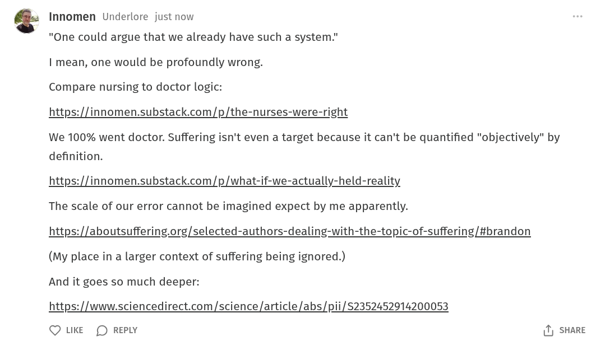

# EE Segment transcript

## Machine transcription

Innomen Underlore just now

"One could argue that we already have such a system."
| mean, one would be profoundly wrong.
Compare nursing to doctor logic:

https://innomen.substack.com/p/the-nurses-were-right

We 100% went doctor. Suffering isn't even a target because it can't be quantified "objectively” by
definition.

https://innomen.substack.com/p/what-if-we-actually-held-reality

The scale of our error cannot be imagined except by me apparently.

https://aboutsuffering.org/selected-authors-dealing-with-the-topic-of-suffering/#brandon

(My place in a larger context of suffering being ignored.)
And it goes so much deeper:

https://www.sciencedirect.com/science/article/abs/pii/S$2352452914200053

Q LKE (D REPLY 1) SHARE
