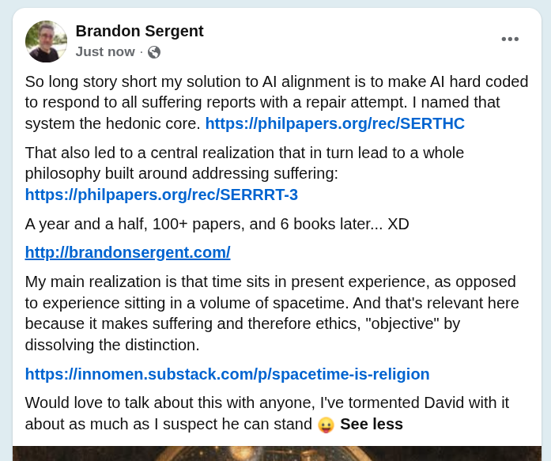

# EE Segment transcript

## Machine transcription

Brandon Sergent
Just now - &

So long story short my solution to Al alignment is to make Al hard coded
to respond to all suffering reports with a repair attempt. | named that
system the hedonic core. https:/iphilpapers.org/rec/SERTHC

That also led to a central realization that in turn lead to a whole
philosophy built around addressing suffering:
https:/iphilpapers.org/rec/SERRRT-3

Avyear and a half, 100+ papers, and 6 books later... XD
http:/ibrandonsergent.com/

My main realization is that time sits in present experience, as opposed
to experience sitting in a volume of spacetime. And that's relevant here
because it makes suffering and therefore ethics, "objective" by
dissolving the distinction.

https:/linnomen.substack.com/p/spacetime-is-religion

Would love to talk about this with anyone, I've tormented David with it
about as much as | suspect he can stand & See less
