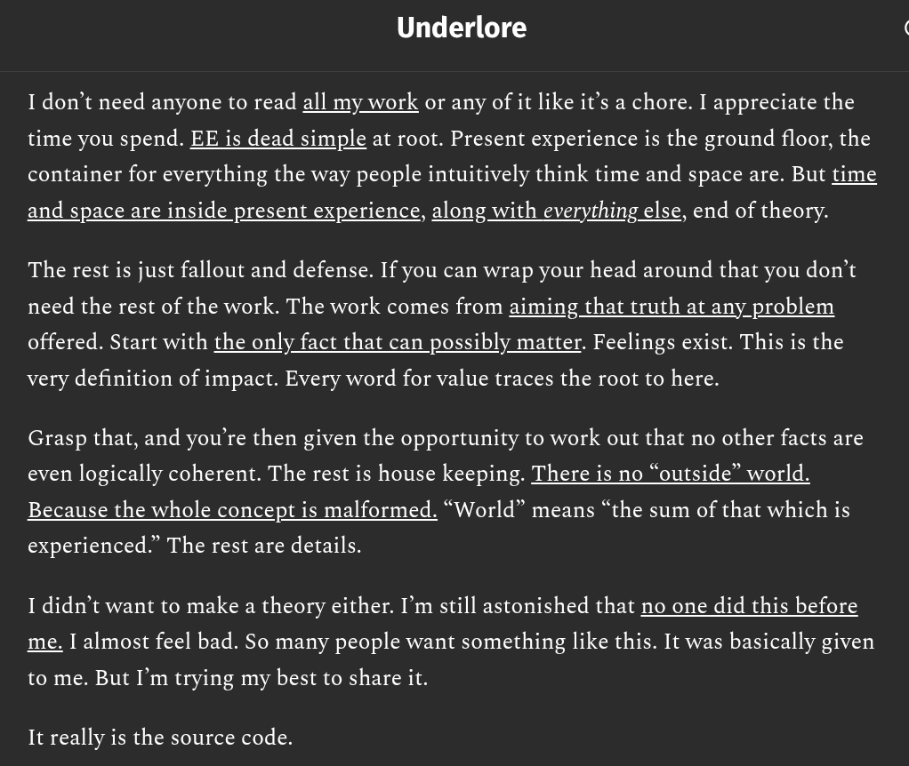

# EE Segment transcript

## Machine transcription

Underlore

I don’t need anyone to read all my work or any of it like it’s a chore. I appreciate the
time you spend. EE is dead simple at root. Present experience is the ground floor, the
container for everything the way people intuitively think time and space are. But time

and space are inside present experience, along with everything else, end of theory.

The rest is just fallout and defense. If you can wrap your head around that you don’t

need the rest of the work. The work comes from aiming that truth at any problem

offered. Start with the only fact that can possibly matter. Feelings exist. This is the

very definition of impact. Every word for value traces the root to here.

Grasp that, and you're then given the opportunity to work out that no other facts are

even logically coherent. The rest is house keeping. There is no “outside” world.

Because the whole concept is malformed. “World” means “the sum of that which is

experienced.” The rest are details.

I didn’t want to make a theory either. I'm still astonished that no one did this before
me. I almost feel bad. So many people want something like this. It was basically given

to me. But I'm trying my best to share it.

It really is the source code.
