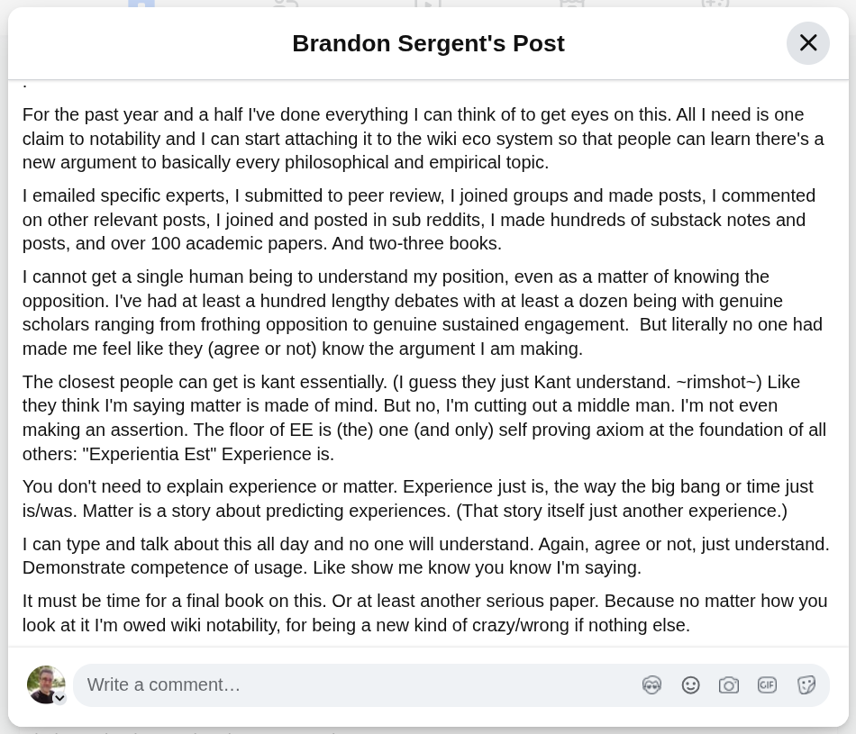

# EE Segment transcript

## Machine transcription

Brandon Sergent's Post X

For the past year and a half I've done everything | can think of to get eyes on this. All | need is one
claim to notability and | can start attaching it to the wiki eco system so that people can learn there's a
new argument to basically every philosophical and empirical topic.

| emailed specific experts, | submitted to peer review, | joined groups and made posts, | commented
on other relevant posts, | joined and posted in sub reddits, | made hundreds of substack notes and
posts, and over 100 academic papers. And two-three books.

| cannot get a single human being to understand my position, even as a matter of knowing the
opposition. I've had at least a hundred lengthy debates with at least a dozen being with genuine
scholars ranging from frothing opposition to genuine sustained engagement. But literally no one had
made me feel like they (agree or not) know the argument | am making.

The closest people can get is kant essentially. (I guess they just Kant understand. ~rimshot~) Like
they think I'm saying matter is made of mind. But no, I'm cutting out a middle man. I'm not even
making an assertion. The floor of EE is (the) one (and only) self proving axiom at the foundation of all
others: "Experientia Est" Experience is.

You don't need to explain experience or matter. Experience just is, the way the big bang or time just
is/was. Matter is a story about predicting experiences. (That story itself just another experience.)

| can type and talk about this all day and no one will understand. Again, agree or not, just understand.
Demonstrate competence of usage. Like show me know you know I'm saying.

It must be time for a final book on this. Or at least another serious paper. Because no matter how you
look at it I'm owed wiki notability, for being a new kind of crazy/wrong if nothing else.

Q‘ Write a comment...
