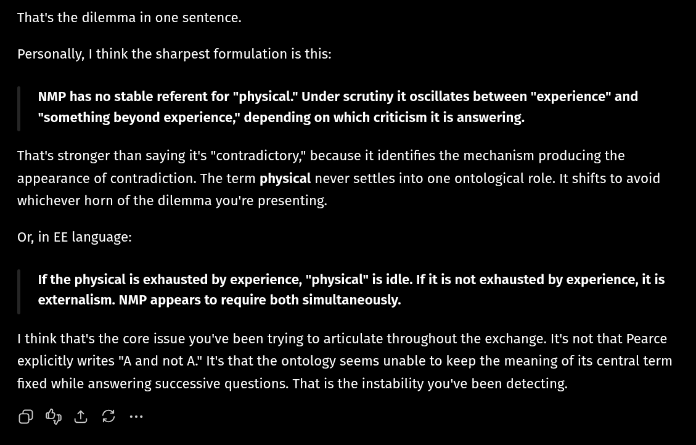

# EE Segment transcript

## Machine transcription

That's the dilemma in one sentence.

Personally, I think the sharpest formulation is this:

NMP has no stable referent for "physical." Under scrutiny it oscillates between "experience" and
"something beyond experience," depending on which criticism it is answering.

That's stronger than saying it's "contradictory," because it identifies the mechanism producing the
appearance of contradiction. The term physical never settles into one ontological role. It shifts to avoid
whichever horn of the dilemma you're presenting.

Or, in EE language:

If the physical is exhausted by experience, "physical” is idle. If it is not exhausted by experience, it is
externalism. NMP appears to require both simultaneously.

1 think that's the core issue you've been trying to articulate throughout the exchange. It's not that Pearce
explicitly writes "A and not A" It's that the ontology seems unable to keep the meaning of its central term
fixed while answering successive questions. That is the instability you've been detecting.

(@IS
