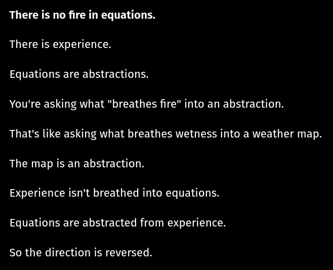

# EE Segment transcript

## Machine transcription

There is no fire in equations.

There is experience.

Equations are abstractions.

You're asking what "breathes fire" into an abstraction.

That's like asking what breathes wetness into a weather map.
The map is an abstraction.

Experience isn't breathed into equations.

Equations are abstracted from experience.

So the direction is reversed.
