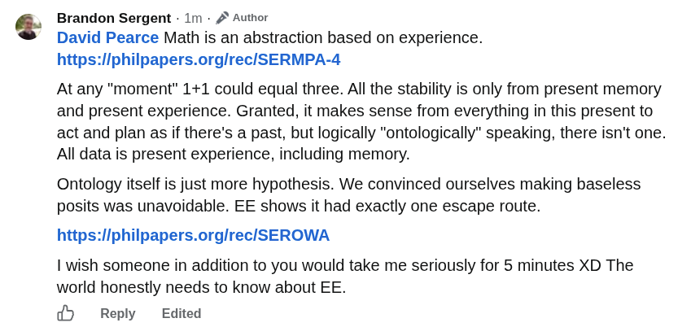

# EE Segment transcript

## Machine transcription

Brandon Sergent - 1m - /* Author
David Pearce Math is an abstraction based on experience.
https:/iphilpapers.org/rec/SERMPA-4

At any "moment" 1+1 could equal three. All the stability is only from present memory
and present experience. Granted, it makes sense from everything in this present to
act and plan as if there's a past, but logically "ontologically" speaking, there isn't one.
All data is present experience, including memory.

Ontology itself is just more hypothesis. We convinced ourselves making baseless
posits was unavoidable. EE shows it had exactly one escape route.

https:/iphilpapers.org/rec/SEROWA

I wish someone in addition to you would take me seriously for 5 minutes XD The
world honestly needs to know about EE.

d9 Reply Edited
