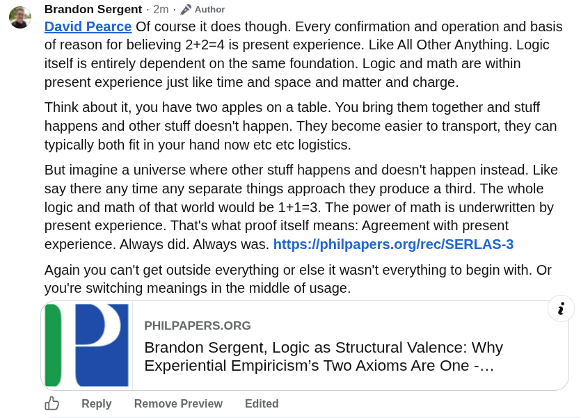

# EE Segment transcript

## Machine transcription

Brandon Sergent - 2m - J* Author

David Pearce Of course it does though. Every confirmation and operation and basis
of reason for believing 2+2=4 is present experience. Like All Other Anything. Logic
itself is entirely dependent on the same foundation. Logic and math are within
present experience just like time and space and matter and charge.

Think about it, you have two apples on a table. You bring them together and stuff
happens and other stuff doesn't happen. They become easier to transport, they can
typically both fit in your hand now etc etc logistics.

But imagine a universe where other stuff happens and doesn't happen instead. Like
say there any time any separate things approach they produce a third. The whole
logic and math of that world would be 1+1=3. The power of math is underwritten by
present experience. That's what proof itself means: Agreement with present
experience. Always did. Always was. https://philpapers.org/rec/SERLAS-3

Again you can't get outside everything or else it wasn't everything to begin with. Or
you're switching meanings in the middle of usage.

i
PHILPAPERS.ORG
Brandon Sergent, Logic as Structural Valence: Why
Experiential Empiricism’s Two Axioms Are One -...

Reply ~ Remove Preview  Edited
