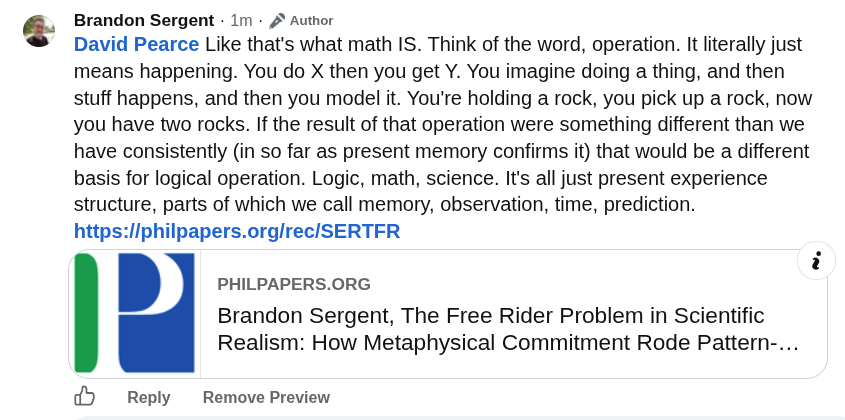

# EE Segment transcript

## Machine transcription

Brandon Sergent - 1m - 2 Author
David Pearce Like that's what math IS. Think of the word, operation. It literally just

means happening. You do X then you get Y. You imagine doing a thing, and then
stuff happens, and then you model it. You're holding a rock, you pick up a rock, now
you have two rocks. If the result of that operation were something different than we
have consistently (in so far as present memory confirms it) that would be a different
basis for logical operation. Logic, math, science. It's all just present experience
structure, parts of which we call memory, observation, time, prediction.
https'IlphiIpapers.orglreclSERTFR

PHILPAPERS.ORG

Brandon Sergent, The Free Rider Problem in Scientific
Realism: How Metaphysical Commitment Rode Pattern-...

Reply  Remove Preview
